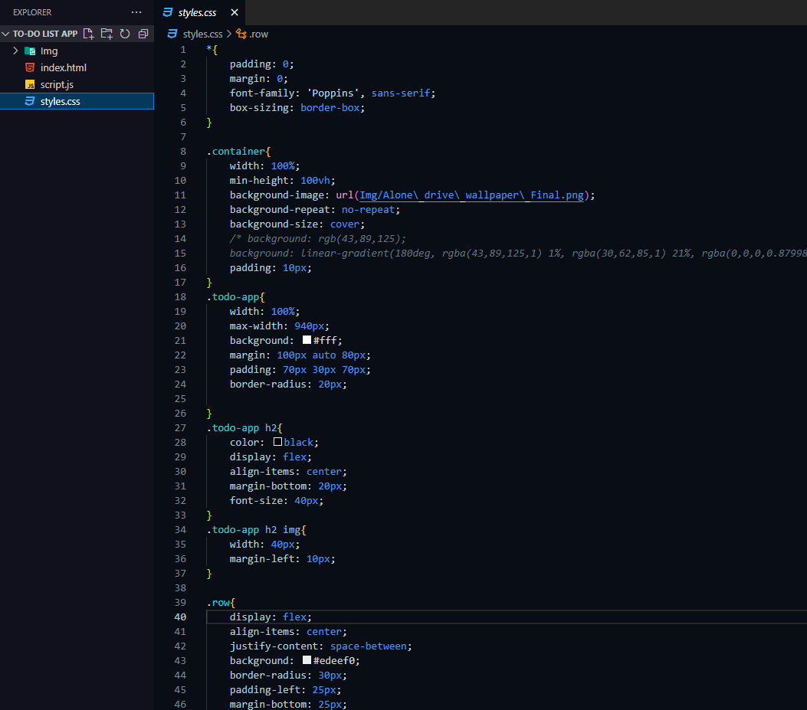
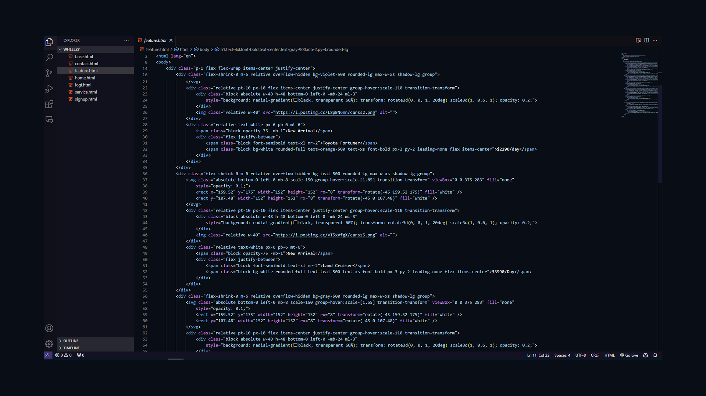
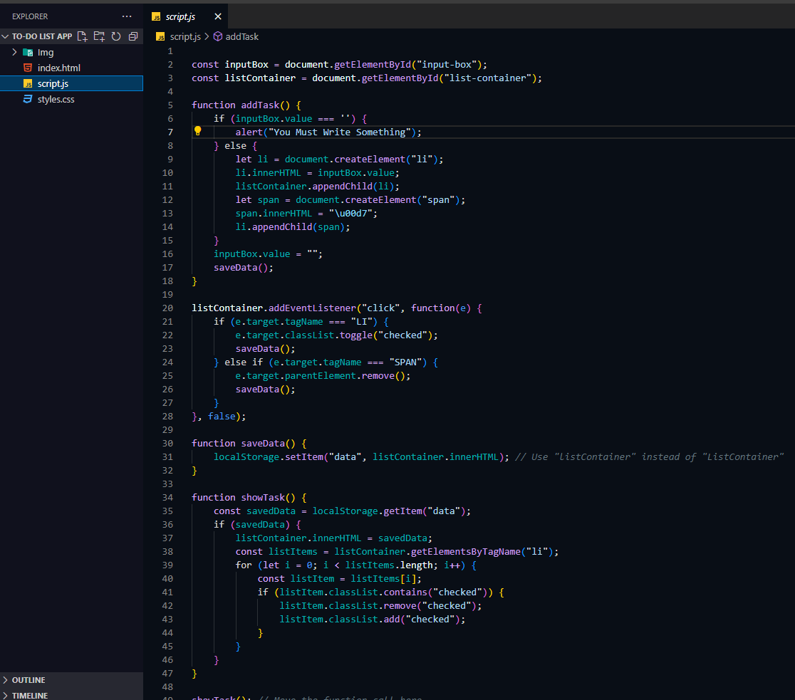

<h1>Nebula Glow Theme</h1>
    
Welcome to Nebula Glow, a visually stunning VS Code theme designed to enhance your coding experience.

    <h2>Features</h2>
    <ul>
        <li>Dark and moody purplish background with hints of white</li>
        <li>Warm and vibrant foreground colors for improved readability</li>
        <li>Subtle teal and bluish accents for a mesmerizing coding environment</li>
    </ul>
    <h2>Preview</h2>
    
    
    
    
 
To install Nebula Glow theme:

    <ol>
        <li>Open Visual Studio Code</li>
        <li>Go to the Extensions view by clicking on the Extensions icon in the Activity Bar.</li>
        <li>Search for "Nebula Glow" and click Install</li>
        <li>Once installed, select Nebula Glow from the Color Theme drop-down menu in the Preferences</li>
    </ol>