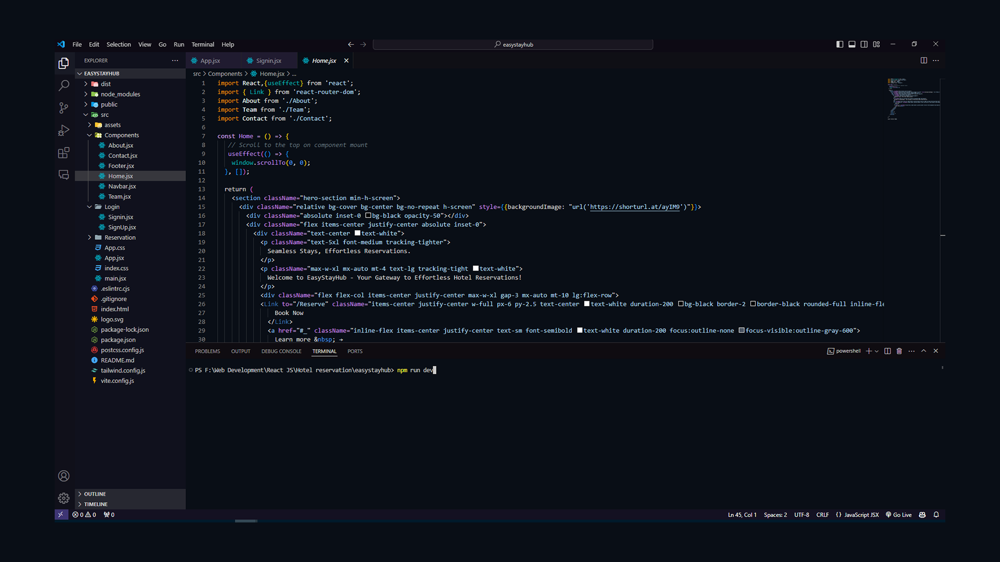

 <h1>Nebula Glow Theme</h1>
    
Welcome to <strong>Nebula Glow</strong>, a visually stunning Visual Studio Code theme designed to elevate your coding experience to new heights.

<h2>✨ Features</h2>
    <ul>
        <li><strong>Dark and Moody Background:</strong> A purplish, deep space-inspired backdrop with subtle hints of white for a calming and focused coding environment.</li>
        <li><strong>Warm and Vibrant Foreground Colors:</strong> Carefully chosen to improve readability and reduce eye strain, allowing you to code longer with comfort.</li>
        <li><strong>Teal and Bluish Accents:</strong> Subtle, mesmerizing accents that highlight important elements without overwhelming the interface.</li>
    </ul>

<h2>🔍 Preview</h2>
    
    
    

<h2>📥 Installation</h2>
    
Follow these simple steps to install the Nebula Glow theme:

    <ol class="installation-steps">
        <li>Open <strong>Visual Studio Code</strong>.</li>
        <li>Navigate to the <strong>Extensions</strong> view by clicking the Extensions icon in the Activity Bar on the side of the window.</li>
        <li>In the search bar, type <strong>"Nebula Glow"</strong> and press <strong>Enter</strong>.</li>
        <li>Click the <strong>Install</strong> button next to the Nebula Glow theme in the search results.</li>
        <li>After installation, open the Command Palette with <strong>Ctrl+Shift+P</strong> (or <strong>Cmd+Shift+P</strong> on macOS), type <strong>Preferences: Color Theme</strong>, and select <strong>Nebula Glow</strong> from the list.</li>
    </ol>

<h2>💡 Additional Information</h2>
    
The <strong>Nebula Glow</strong> theme is designed to provide an immersive and aesthetically pleasing coding environment. With its carefully balanced color palette, it ensures that your code stands out while your eyes remain comfortable. Perfect for late-night coding sessions or long programming marathons.

    
 <h2>Feedback</h2>
    
Your feedback is invaluable to us. If you encounter any issues or have any ideas for new features, please open an issue on the <a href="https://github.com/yeakiniqra/Nebula-glow-theme/issues">GitHub repository</a>.

Thank you for choosing Nebula Glow. Happy coding!
    